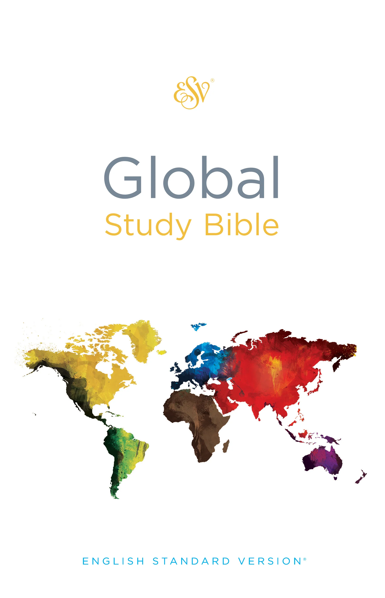

  

[**Download PDF v4**](https://drive.google.com/uc?export=download&id=1RE797UzxmUtYFD7B9VVtuLVHEdGg1s_H)

> Recommended to read in two-column (two-page or landscape or horizontal) layout (orientation). Microsoft Edge web browser has this feature built-in, some other web browsers might too. See example why its useful and how to enable it in Edge in the image below.

#### Access ESV Global Study Bible online

1. Go to [ESV.org](https://www.esv.org/Matthew+1/)
2. Select Library section in the sidebar
	
3. Select the Global Study Bible
	
4. Read the Holy Bible and praise Jesus Christ our Holy Lord GOD Almighty ✝️❣️🙏
	

#### Access all ESV.org resources for free
> If you're **not** in 🇺🇸 USA, 🇬🇧 UK, 🇨🇦 Canada, or 🇦🇺 Australia, all the ESV resources, including the ESV Study Bible, are available for free

1. Have an ESV.org account
2. Go [here](https://www.ESV.org/international/) and fill out the little form
	
1. Read the Holy Bible and praise Jesus Christ our Holy Lord GOD Almighty ✝️💟🙏